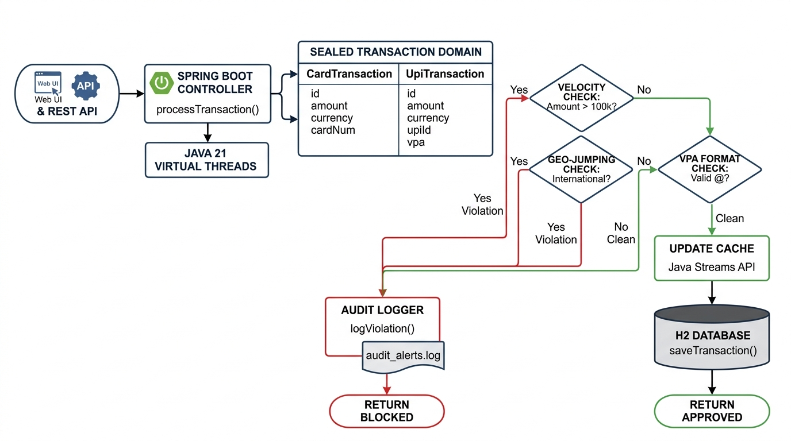

# 🛡️ FraudGuard 21 — Smart Transaction Fraud Detection System

A high-performance, real-time transaction fraud detection system built with **Java 21**, **Spring Boot 3**, and modern design patterns.

---

## 🌟 Key Features & Java 21 Innovations

- **Java 21 Records & Sealed Types**: Domain models use immutable `record Location` and a sealed hierarchy (`Transaction` permitting `CardTransaction` and `UpiTransaction`).
- **Pattern Matching for `switch`**: Clean polymorphic rule evaluation eliminating verbose `instanceof` casts.
- **Java 21 Virtual Threads**: Highly concurrent transaction throughput using `Executors.newVirtualThreadPerTaskExecutor()`.
- **In-Memory Caching & Streams**: Thread-safe `TransactionCache` backed by `ConcurrentHashMap` with real-time average transaction calculations via Java Streams.
- **Audit File Logging**: Automatic persistent logging of blocked fraudulent transactions to `audit_alerts.log` via character streams in try-with-resources.
- **Relational Persistence (DAO Pattern)**: Parameterized JDBC PreparedStatement implementation for PostgreSQL / MySQL storage.
- **Spring Boot REST API**: Web endpoints (`/api/fraud/evaluate`, `/api/fraud/history/{id}`, `/api/fraud/audit-log`).
- **Interactive Web UI**: Built-in responsive web dashboard on `http://localhost:8080/` with 1-click test scenarios.

---

## 🏛️ System Architecture Flowchart



---

## 📐 Project Structure

```
fraud-detection-system/
├── pom.xml                                 # Maven descriptor
├── run.bat                                 # One-click Spring Boot REST API launcher
├── run-simulation.bat                      # One-click Virtual Threads simulation
├── src/main/java/com/fraud/sys/
│   ├── FraudDetectionApplication.java      # Spring Boot Main
│   ├── model/                              # Phase 1: Records & Sealed Interface
│   │   ├── Location.java
│   │   ├── Transaction.java
│   │   ├── CardTransaction.java
│   │   └── UpiTransaction.java
│   ├── exceptions/                         # Phase 2: Custom Exceptions
│   │   └── FraudDetectedException.java
│   ├── rules/                              # Phase 2: Rule Engine
│   │   ├── FraudRule.java
│   │   ├── VelocityRule.java
│   │   └── GeoJumpingRule.java
│   ├── cache/                              # Phase 3: In-Memory State & Streams
│   │   ├── UserHistory.java
│   │   └── TransactionCache.java
│   ├── engine/                             # Phase 4: Core Engine & Virtual Threads
│   │   └── TransactionProcessor.java
│   ├── io/                                 # Phase 5: File I/O Audit Logging
│   │   └── AuditLogger.java
│   ├── dao/                                # Phase 6: JDBC Persistence & DAO
│   │   ├── GenericDAO.java
│   │   └── TransactionDAOImpl.java
│   └── controller/                         # Phase 7: REST API & DTOs
│       ├── TransactionRequest.java
│       ├── EvaluationResponse.java
│       └── FraudController.java
└── src/main/resources/
    ├── application.properties
    ├── schema.sql                          # Database DDL
    └── static/
        └── index.html                      # Interactive Web Dashboard
```

---

## 🚀 Quick Start

### Prerequisites
- **Java 21**: OpenJDK 21 or Eclipse Temurin 21
- **Maven 3.9+**

### Option 1: Launch Web Application (Port 8080)
```powershell
.\run.bat
```
*(Or via Maven: `mvn spring-boot:run`)*

Open your browser at **[http://localhost:8080/](http://localhost:8080/)** to access the interactive fraud evaluation dashboard.

### Option 2: Run Virtual Threads Simulation
```powershell
.\run-simulation.bat
```
Runs 10 mock transactions concurrently across Java 21 Virtual Threads and prints rule evaluations to the console.

---

## 📡 REST API Reference

### 1. Evaluate Transaction
**Endpoint:** `POST /api/fraud/evaluate`  
**Content-Type:** `application/json`

#### Example Request:
```json
{
  "txId": "TXN-901",
  "accountId": "ACC-101",
  "amount": 15000.0,
  "city": "Mumbai",
  "country": "INDIA",
  "type": "CARD",
  "cardNumber": "4111-2222-3333-4444",
  "isInternational": false
}
```

#### Example Response (Approved):
```json
{
  "txId": "TXN-901",
  "status": "APPROVED",
  "message": "Transaction passed all fraud checks",
  "timestamp": "2026-09-23T14:40:00Z"
}
```

#### Example Response (Blocked):
```json
{
  "txId": "TXN-902",
  "status": "BLOCKED",
  "message": "Card transaction [TXN-902] failed VelocityRule: Amount 150000.0 exceeds limit of 100,000",
  "timestamp": "2026-09-23T14:40:15Z"
}
```

---

## 📜 License
MIT License. Built with ❤️ in Java 21.
